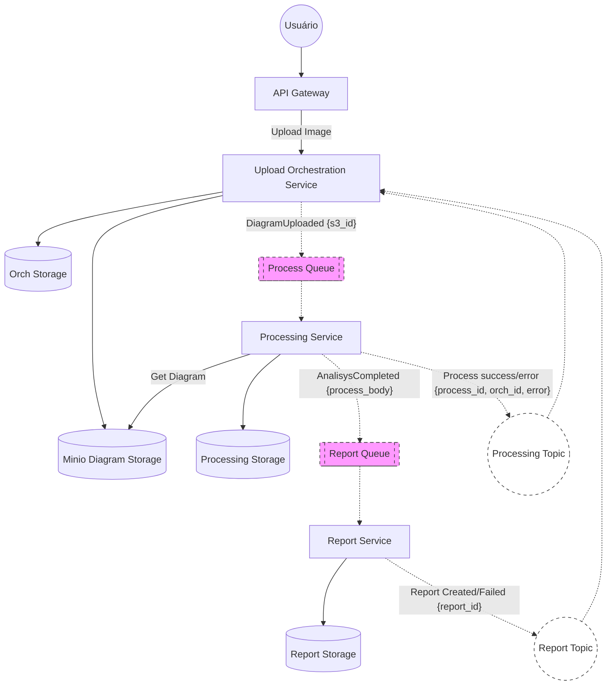

# AGENT.MD - Arquitetura de Microsserviços para Processamento de Diagramas com IA

## 1. Contexto do Projeto
Este projeto visa criar um MVP para a **FIAP Secure Systems** focado na análise automática de diagramas de arquitetura de software enviados como Imagem [cite: 14, 17]. O sistema extrai componentes, identifica riscos e gera recomendações técnicas usando Inteligência Artificial [cite: 57, 60].

## 2. Princípios Arquiteturais
* **Microsserviços:** Divisão funcional com bancos de dados isolados [cite: 63, 71].
* **Clean Architecture:** Implementação interna focada em independência de frameworks e isolamento de domínio [cite: 68, 160].
* **Event-Driven (Saga Coreografada):** Comunicação assíncrona para fluxos de processamento pesado e gestão de estado [cite: 66, 165, 179].
* **Asynchronous Request-Reply:** Padrão para consulta de status (Polling) via REST [cite: 310].

## 3. Topologia de Serviços
| Serviço | Responsabilidade Principal | Persistência |
| :--- | :--- | :--- |
| **API Gateway / BFF** | Porta de entrada única, roteamento e autenticação [cite: 74, 151]. | N/A |
| **Upload Orchestrator** | Recebe arquivos, inicia o processo e gerencia a máquina de estados [cite: 75, 153]. | PostgreSQL (Status Tracking) [cite: 163] |
| **Processing Service (IA)** | Consome diagramas, interage com LLM/Modelos de visão e gera análise [cite: 76, 155]. | DynamoDB (Key-Value) (Status de processamento e informações históricas de processamento com a IA - Timestamp, Prompt utilizado, Resposta obtida) |
| **Report Service** | Consolida resultados da análise e gera o relatório técnico final [cite: 77, 159]. | MongoDB (NoSQL) [cite: 163] |

## 4. Fluxo da Solução (Data Flow)
1.  **Ingestão:** Usuário faz upload via Gateway para o `Upload Service`. O arquivo é salvo no **S3/MinIO** [cite: 153].
2.  **Início do Processo:** O Orquestrador publica `DiagramUploaded` na `Process Queue` [cite: 154].
3.  **Processamento IA:** O `Processing Service` consome a fila e emite `ProcessingStarted`. Ao finalizar, publica `AnalysisCompleted` com o payload da análise [cite: 182, 186, 188].
4.  **Relatório:** O `Report Service` consome a conclusão, salva no `Report Storage` e publica `ReportCreated` [cite: 287].
5.  **Finalização:** O Orquestrador atualiza o status final para "Analisado" e registra o ID do relatório [cite: 288].

## 5. Referências Funcionais
Para detalhes sobre os casos de uso e rotas de API, consulte: [FUNCTIONAL_SPEC.MD](./FUNCTIONAL_SPEC.MD) [cite: 123].

## 6. Padrões Técnicos Obrigatórios (todas as aplicações Go)

### 6.1 Clean Architecture
Cada serviço deve organizar seu código nas seguintes camadas internas, sem dependência reversa entre elas:

```
internal/
├── domain/       ← Entidades, value objects, erros de domínio (sem dependências externas)
├── usecase/      ← Regras de negócio, orquestra domínio + portas (interfaces)
├── repository/   ← Implementações concretas de persistência (satisfaz interfaces do usecase)
├── handler/      ← Entrada HTTP (Gin) — converte request → usecase → response
├── consumer/     ← Entrada de eventos (RabbitMQ) — converte mensagem → usecase
└── config/       ← Leitura de variáveis de ambiente, inicialização de dependências
```

**Regra de dependência:** `handler` e `consumer` dependem de `usecase`; `usecase` depende apenas de interfaces; `repository` implementa as interfaces definidas em `usecase`.

### 6.2 Framework REST — Gin Gonic
- **Biblioteca:** `github.com/gin-gonic/gin v1.10+`
- Usar `gin.New()` (não `gin.Default()`) para controlar explicitamente os middlewares adicionados.
- Middlewares obrigatórios em todos os servidores HTTP: `gin.Recovery()`, logger estruturado, New Relic (`nrgin.Middleware`).
- Todos os handlers recebem `*gin.Context` e retornam via `c.JSON(status, payload)`.
- Rotas de healthcheck (`/ping`) fora de grupos autenticados.

### 6.3 ORM para Bancos Relacionais — GORM
- **Biblioteca:** `gorm.io/gorm v1.25+` com driver `gorm.io/driver/postgres`
- Aplicável apenas ao **upload-orchestrator** (PostgreSQL).
- Modelos GORM devem embutir `gorm.Model` (ID, CreatedAt, UpdatedAt, DeletedAt) ou campos equivalentes explícitos.
- Migrações automáticas via `db.AutoMigrate(&Model{})` — aceitável para MVP; em produção substituir por migrações versionadas.
- Nunca passar SQL raw sem prepared statements; usar `db.Where("campo = ?", valor)`.

### 6.4 Observabilidade — New Relic
- **Biblioteca:** `github.com/newrelic/go-agent/v3 v3.35+`
- **Integração Gin:** `github.com/newrelic/go-agent/v3/integrations/nrgin`
- Configuração via variáveis de ambiente (`NEW_RELIC_LICENSE_KEY`, `NEW_RELIC_APP_NAME`).
- Cada serviço inicializa `newrelic.NewApplication(newrelic.ConfigFromEnvironment())` na startup.
- Serviços sem HTTP (processing-service) instrumentam spans manualmente via `txn.StartSegment`.
- Consumers RabbitMQ devem iniciar uma transação New Relic por mensagem processada.

## 7. Diagrama de arquitetura high-Level da solução
