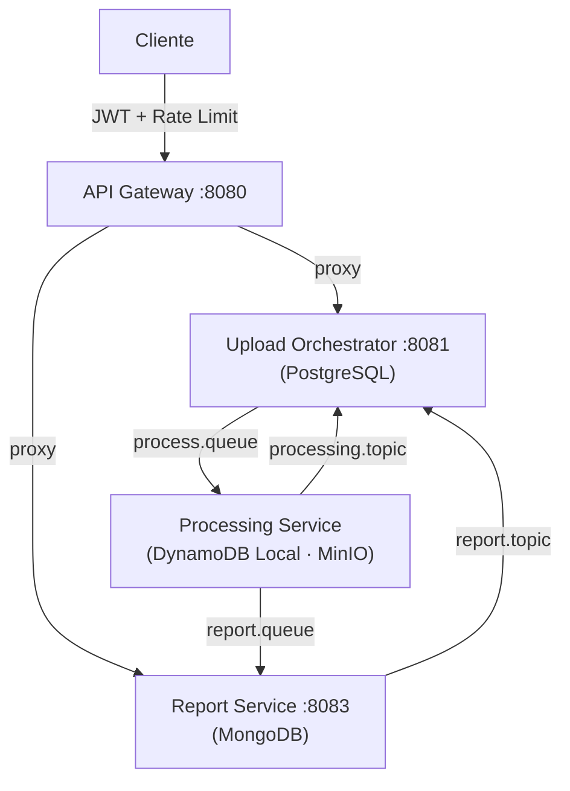
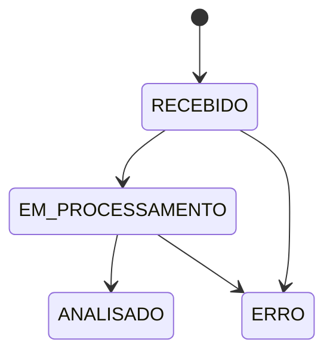
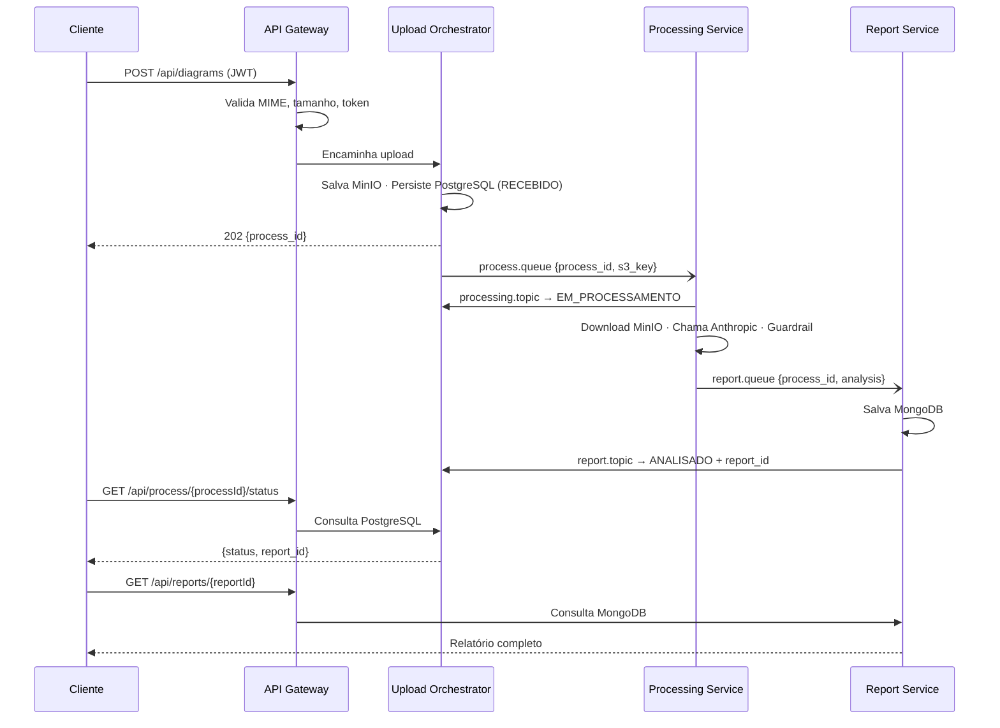

# FIAP Secure Systems — Analisador de Diagramas com IA

MVP de microsserviços em **Go** para análise automática de diagramas de arquitetura de software, com geração de relatórios de segurança via Inteligência Artificial.

---

## Descrição do Problema

Equipes de desenvolvimento e arquitetura precisam garantir que seus sistemas atendam a boas práticas de segurança desde a fase de design. Contudo, a revisão manual de diagramas de arquitetura é lenta, subjetiva e depende de especialistas nem sempre disponíveis.

**O sistema resolve isso automatizando três etapas:**

1. **Ingestão segura** — recebe imagens de diagramas (PNG, JPEG, WebP, PDF) com validação de tipo por conteúdo binário, autenticação JWT e rate limiting por IP.
2. **Análise por IA** — envia o diagrama para um modelo de visão (Claude da Anthropic), que identifica componentes, riscos de segurança e recomendações técnicas.
3. **Relatório persistido** — consolida o resultado em um relatório consultável via REST, com rastreabilidade completa do processo.

---

## Arquitetura Proposta

O sistema é composto por **4 microsserviços independentes** com bancos de dados isolados, comunicação assíncrona via RabbitMQ e armazenamento de arquivos no MinIO.



### Serviços

| Serviço | Porta | Banco | Responsabilidade |
|---|---|---|---|
| `api-gateway` | 8080 | — | Autenticação JWT, rate limiting, validação de MIME, proxy |
| `upload-orchestrator` | 8081 | PostgreSQL | Recebe arquivo, persiste no MinIO, gerencia máquina de estados |
| `processing-service` | — | DynamoDB Local | Consumer RabbitMQ, chama LLM com visão, grava histórico |
| `report-service` | 8083 | MongoDB | Consumer RabbitMQ, consolida relatório, expõe via REST |

### Infraestrutura

| Componente | Porta | Uso |
|---|---|---|
| RabbitMQ | 5672 / 15672 | `process.queue` (work queue) + `processing.topic` / `report.topic` (fanout) |
| MinIO | 9000 / 9001 | Armazenamento de diagramas (bucket `diagrams`) |
| PostgreSQL | 5432 | Tracking de status dos processos |
| MongoDB | 27017 | Persistência dos relatórios |
| DynamoDB Local | 8000 | Histórico de execuções de IA (timestamp, prompt, resposta) |

---

## Fluxo da Solução





---

## Instruções de Execução

### Pré-requisitos

- [Docker](https://docs.docker.com/get-docker/) e Docker Compose v2
- [Go 1.23+](https://go.dev/dl/) (apenas para desenvolvimento local)
- Chave de API da Anthropic (`LLM_API_KEY`)

### Início rápido

```bash
# 1. Clone o repositório
git clone <url-do-repo> && cd Hacka

# 2. Configure as variáveis de ambiente
cp .env.example .env
# Edite .env e preencha obrigatoriamente:
#   LLM_API_KEY=sk-ant-...   (Anthropic)
#   JWT_SECRET=...           (mínimo 32 caracteres)

# 3. Suba todos os serviços
docker compose up --build -d

# 4. Verifique os healthchecks
curl http://localhost:8080/ping   # api-gateway
curl http://localhost:8081/ping   # upload-orchestrator
curl http://localhost:8083/ping   # report-service
```

### Gerar token JWT para testes

```bash
# A partir da raiz do projeto
cp .env.example .env   # edite JWT_SECRET, AUTH_USERNAME, AUTH_PASSWORD_HASH e LLM_API_KEY

# Gerar hash bcrypt para AUTH_PASSWORD_HASH (já escapado para o Docker Compose):
htpasswd -bnBC 10 "" SUA_SENHA | tr -d ':\n' | sed 's/\$/\$\$/g'
```

### Testar o fluxo completo

```bash
JWT="<token-gerado>"

# 1. Upload do diagrama
RESP=$(curl -s -X POST http://localhost:8080/api/diagrams \
  -H "Authorization: Bearer $JWT" \
  -F "diagram=@/caminho/para/diagrama.png")
PROCESS_ID=$(echo $RESP | python3 -c "import sys,json; print(json.load(sys.stdin)['process_id'])")

# 2. Aguardar processamento (poll a cada 5s)
watch -n 5 "curl -s http://localhost:8080/api/process/$PROCESS_ID/status \
  -H 'Authorization: Bearer $JWT'"

# 3. Quando status = ANALISADO, buscar o relatório
REPORT_ID="<report_id da resposta acima>"
curl http://localhost:8080/api/reports/$REPORT_ID \
  -H "Authorization: Bearer $JWT"
```

### Importar collection Insomnia

Importe o arquivo `insomnia_collection.json` no Insomnia:
`Application → Import/Export → Import Data → From File`

### Variáveis de ambiente obrigatórias

| Variável | Descrição |
|---|---|
| `JWT_SECRET` | Secret HS256 para assinatura de tokens (mín. 32 chars) |
| `LLM_API_KEY` | Chave da API Anthropic |
| `POSTGRES_PASSWORD` | Senha do PostgreSQL |
| `MONGO_PASSWORD` | Senha do MongoDB |
| `MINIO_ROOT_PASSWORD` | Senha do MinIO |
| `RABBITMQ_PASSWORD` | Senha do RabbitMQ |

> **Segurança:** nunca comite o arquivo `.env`. Ele está no `.gitignore`.

---

## Segurança

### Requisitos básicos adotados

| Controle | Implementação |
|---|---|
| Autenticação | JWT HS256 obrigatório em todas as rotas `/api/*`; secret mínimo de 32 caracteres |
| Autorização | Sem acesso direto aos serviços internos (passam pelo gateway) |
| Validação de tipo de arquivo | `http.DetectContentType` nos primeiros 512 bytes do conteúdo binário — nunca pela extensão |
| Limite de tamanho | `http.MaxBytesReader` no gateway antes de qualquer parse de multipart |
| Rate limiting | 100 req/min por IP no gateway com burst de 20, usando `golang.org/x/time/rate` |
| Queries parametrizadas | GORM com `Where("campo = ?", val)` — sem SQL raw em nenhum serviço |
| Validação de UUID | `uuid.Parse` antes de qualquer consulta ao banco (previne IDOR e queries desnecessárias) |
| Credenciais | Zero credenciais no código — exclusivamente via variáveis de ambiente |
| Imagens Docker | Base `alpine:3.21` com usuário não-root (`adduser -D appuser`) |
| Rastreamento | `X-Request-ID` propagado a todos os serviços internos |

### Validação e tratamento de entradas não confiáveis

- **Arquivos:** MIME detectado por conteúdo binário (não extensão); `MaxBytesReader` limita tamanho antes de qualquer leitura; `sanitizeFilename` remove `..`, `/` e `\` do nome do arquivo.
- **Parâmetros de URL:** `uuid.Parse` valida `processId` e `reportId` antes de consultar PostgreSQL e MongoDB — retorna 400 sem tocar no banco.
- **Mensagens RabbitMQ:** `json.Unmarshal` com validação de campos obrigatórios; mensagens inválidas recebem `Nack(false, false)` — descartadas sem requeue para evitar loop infinito.
- **Respostas da IA:** validadas pelo guardrail antes de qualquer persistência (ver seção abaixo).

### Uso controlado de modelos de IA

O `processing-service` usa o modelo `claude-sonnet-4-6` (Anthropic) exclusivamente para análise de diagramas de arquitetura de software. O escopo é restrito pelo prompt de sistema:

```
Analyze the provided architecture diagram and identify:
1. All components: services, databases, queues, load balancers, APIs, and infrastructure elements
2. Security risks: vulnerabilities, missing controls, insecure patterns, attack surfaces
3. Technical recommendations: concrete actions to improve security and resilience
Rules: Return ONLY a valid JSON object...
```

A previsibilidade é reforçada por:
- Modelo fixado via variável de ambiente `LLM_MODEL` (sem seleção dinâmica pelo usuário)
- `MaxTokens` configurável com limite máximo de 8192 tokens
- Instrução explícita de formato JSON sem markdown

### Tratamento seguro de falhas da IA

O guardrail (`parseAndValidate`) executa antes de qualquer persistência:

1. **Strip de markdown fences** — remove ` ```json ... ``` ` que o modelo pode adicionar
2. **JSON parsing** — falha se a resposta não for JSON válido
3. **Validação de campos obrigatórios** — `components`, `risks` e `recommendations` devem ter ao menos 1 item
4. **Em caso de falha do guardrail:**
   - DynamoDB atualizado para `ERROR` com mensagem descritiva
   - Evento `processing_error` publicado no `processing.topic`
   - Upload-orchestrator atualiza PostgreSQL para `ERRO`
   - Mensagem recebe `Nack` sem requeue (não fica em loop)

### Comunicação entre serviços

- Todos os serviços internos comunicam-se via rede Docker isolada (`hacka_default`)
- URLs dos serviços internos configuradas exclusivamente por variáveis de ambiente
- `X-Request-ID` propagado em todos os requests HTTP internos para rastreabilidade
- RabbitMQ usa filas duráveis (`durable: true`) e mensagens persistentes (`delivery_mode: 2`)
- Timeouts HTTP configurados: 60s para upload, 15s para consultas

> **Limitação atual:** não há mTLS entre serviços — todo tráfego interno é HTTP plaintext. Em produção, recomenda-se service mesh (ex: Istio) ou TLS mútuo.

### Principais riscos e limitações

| Risco | Severidade | Mitigação atual | Recomendação para produção |
|---|---|---|---|
| Sem mTLS entre serviços | Média | Rede Docker isolada | Implementar mTLS ou service mesh |
| LLM pode alucinar resultados | Média | Guardrail de formato + campos obrigatórios | Adicionar validação semântica de findings |
| DynamoDB Local em memória | Baixa (dev) | — | Usar DynamoDB AWS real com backup habilitado |
| Sem revogação de JWT | Média | Tokens com expiração de 24h | Implementar blocklist com Redis |
| RabbitMQ sem autenticação mútua | Baixa | Usuário/senha + rede isolada | Habilitar TLS no broker |
| Logs podem conter dados sensíveis | Baixa | `raw_response` não é logado | Implementar log scrubbing |

---

### Consoles de administração

| Serviço | URL | Credenciais |
|---|---|---|
| RabbitMQ Management | http://localhost:15672 | `guest` / `RABBITMQ_PASSWORD` |
| MinIO Console | http://localhost:9001 | `minioadmin` / `MINIO_ROOT_PASSWORD` |
